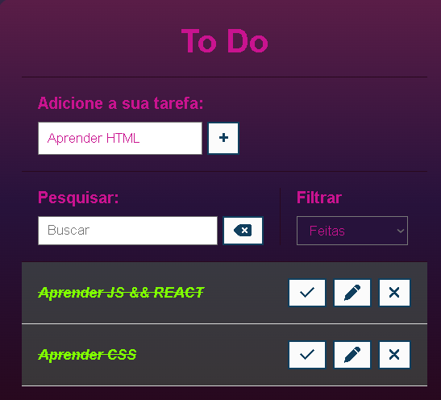

# To-Do WEB

# Sobre o projeto

### Projeto com um nivel de dificuldade mediano, o maior problema que tive foi na utilização do local storage para armazenar as informações. 

## Layout principal

 

## Funcionalidades
Consiste em um organizador de tarefas interativo e com varias funcionalidades um CRUD completo e opções de pesquisa e filtragem.



# Tecnologias utilizadas
## Back end
- JavaScript
## Front end
- HTML / CSS 


# Como executar o projeto

```bash
# clonar repositório
git https://github.com/JGMeneses/Projeto-ToDo.git
# executar o o index.html utilizando a extensão GoLive

```


# Autor

João Victor Gomes Meses
